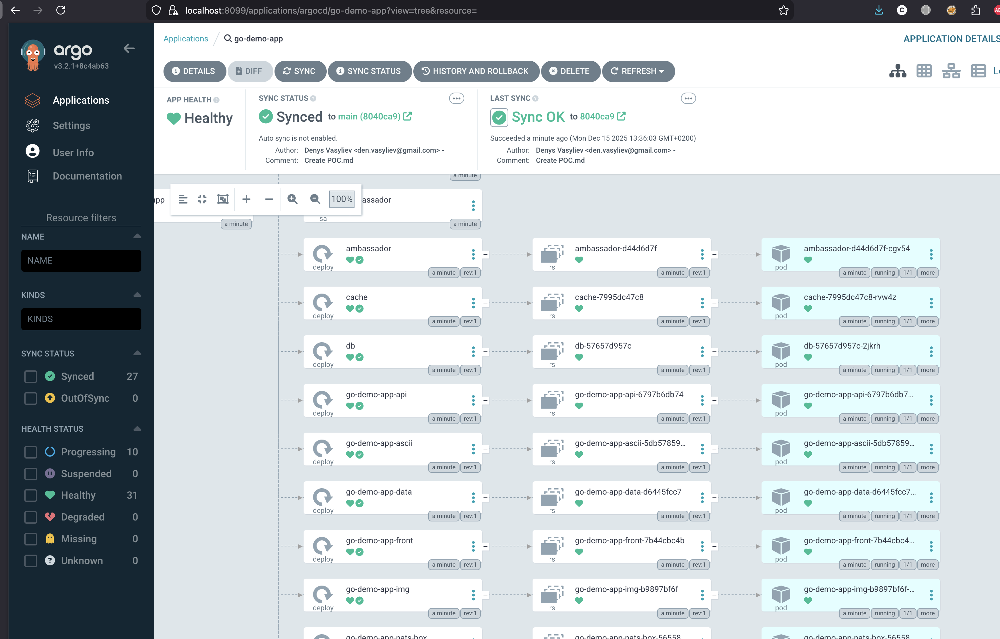
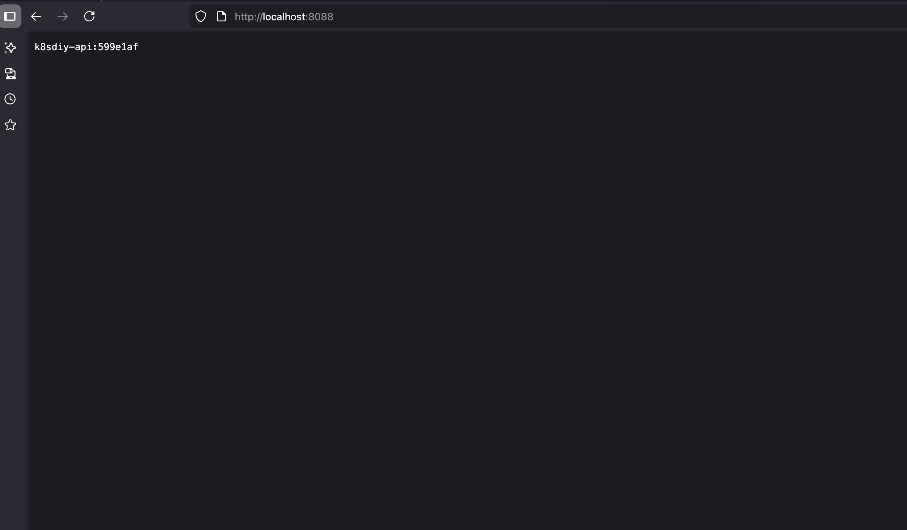
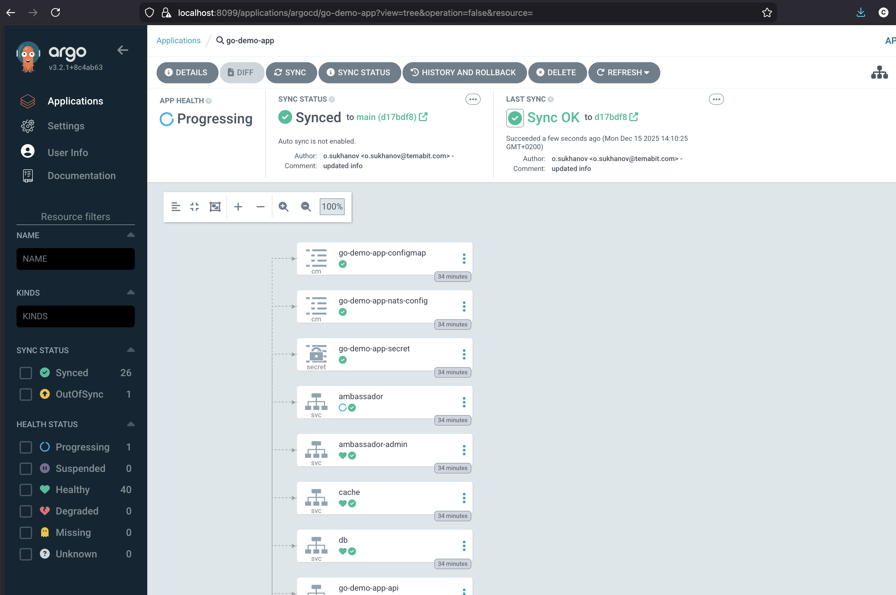

# MVP: GitOps-пайплайн для AsciiArtify з ArgoCD

## Мета

Налаштувати повний GitOps-пайплайн, де ArgoCD автоматично відстежує зміни в Git-репозиторії додатка та синхронізує їх з Kubernetes кластером. Це демонструє механізм безперервного розгортання, готовий для фокус-групи.

## Передумови

- Кластер K3d та ArgoCD, розгорнуті згідно [POC інструкції](POC.md).
- Веб-інтерфейс ArgoCD доступний за адресою `https://localhost:8080`.
- Для зйомки демо-відео можна використовувати будь-який інструмент для захоплення екрану (наприклад, QuickTime на macOS, OBS Studio).

---

## Частина 1: Створення додатка в ArgoCD

1. **Увійдіть у веб-інтерфейс ArgoCD** (`https://localhost:8080`) з логіном `admin` та паролем.
2. Натисніть **"NEW APP"**, щоб створити новий додаток. Заповніть форму:
    - **Application Name:** `go-demo-app`
    - **Project:** `default`
    - **Sync Policy:** `Automatic` (це ключовий параметр для автосинхронізації)
3. У секції **"Source"** вкажіть Git-репозиторій:
    - **Repository URL:** `https://github.com/den-vasyliev/go-demo-app`
    - **Revision:** `HEAD`
    - **Path:** `.` (корінь репозиторію)
4. У секції **"Destination"** вкажіть кластер, куди розгортати:
    - **Cluster URL:** `https://kubernetes.default.svc` (поточний кластер)
    - **Namespace:** `default`
5. Натисніть **"CREATE"**, а потім **"CREATE & SYNC"** у спливаючому вікні.
6. Переконайтеся, що додаток успішно синхронізувався та всі ресурси мають статус `Healthy`. Тепер додаток розгорнуто!



### **Отримання доступу до додатка (через LoadBalancer)**

Оскільки K3d створює вбудований LoadBalancer, сервіс додатка доступний через нього:

```bash
# Запит до додатка через порт балансувальника, зіставлений на етапі POC
curl http://localhost:8080
```



## Частина 2: Оновлення додатка в ArgoCD

Мы можемо зробити будь які зміни в репозиторії для проекту, після Argo має підхоплювати їх в залежності від налаштувань,
та оновити усі взаємодіючі компоненти.


