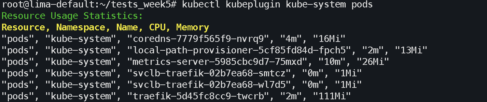

# Kubernetes Resource Usage Plugin (kubeplugin)

Плагін для kubectl для отримання статистики використання ресурсів (CPU/Memory) в Kubernetes кластері.

## 📋 Опис

Плагін `kubeplugin` надає зручний спосіб перегляду статистики використання ресурсів (CPU та Memory) для різних ресурсів Kubernetes у форматі CSV.

## 🚀 Встановлення

### Спосіб 1: Ручне встановлення

# Клонувати репозиторій

```bash
git clone <url-вашого-репозиторію>
cd <назва-репозиторію>
```

# Зробити скрипт виконуваним

```bash
chmod +x scripts/kubeplugin
```

# Додати до PATH (опціонально)

```bash
sudo cp scripts/kubeplugin /usr/local/bin/kubectl-kubeplugin
```

## Використання

# Основний синтаксис

```bash
kubectl kubeplugin <namespace> <тип-ресурсу>
```

## Параметри

Ім'я namespace (наприклад: default, kube-system)

all - для всіх namespaces

pods - Pods

deployments - Deployments

statefulsets - StatefulSets

daemonsets - DaemonSets

replicasets - ReplicaSets

cronjobs - CronJobs

jobs - Jobs

## Команди допомоги

# Показати довідку

kubectl kubeplugin --help
kubectl kubeplugin -h

# Показати версію

kubectl kubeplugin --version
kubectl kubeplugin -v

## Приклади

# Приклад 1: Статистика Pods в kube-system

```bash
kubectl kubeplugin kube-system pods
```

# Вивід


